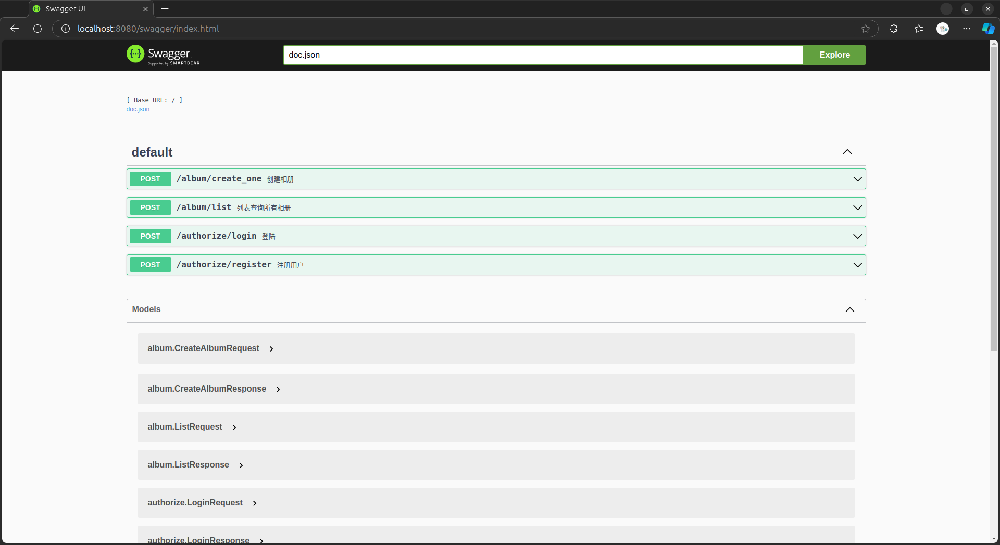

在go中使用Swagger
===

Swagger 的优点这里就不赘述了。简单说下怎么在go中使用swagger。   

Swagger主要的库为
静态文件 https://github.com/swaggo/files   
gin插件和处理器  https://github.com/swaggo/gin-swagger    
swagger主体 https://github.com/swaggo/swag    

## 环境准备

### 安装命令行插件
该插件 swag 将Go的注释转换为Swagger2.0文档。

```shell
go install github.com/swaggo/swag/cmd/swag@latest
swag --version
swag version v1.16.4
```

## 使用
### 编写注释
```go
package authorize

import (
	"onenet/internal"
	"onenet/internal/service"
)

type (

	// LoginRequest
	// 登陆时所需要的参数
	LoginRequest struct {
		LoginName string `json:"login_name" binding:"required"` // 用户名
		Scrip     string `json:"scrip" binding:"required"`      // 编码
	}

	// LoginResponse
	// 登陆成功后的响应参数
	LoginResponse struct {
		SessionID    string `json:"session_id"`
		AccessToken  string `json:"access_token"`
		RefreshToken string `json:"refresh_token"`
		User         string `json:"user"`
	}
)

// Login
// @BasePath /authorize/login
// @Summary 登陆
// @Description 登陆
// @Accept json
// @Produce json
// @Param json body authorize.LoginRequest true "登陆时所需要的信息"
// @Success 200 {object} internal.CommonResponse[authorize.LoginResponse] "token信息"
// @Router /authorize/login [POST]
func Login(ctx *internal.Context) {
	var loginRequest LoginRequest
	err := ctx.ShouldBind(&loginRequest)
	if err != nil {
		ctx.Fail(err)
		return
	}
	accessToken, refreshToken, err := service.AuthorizeService().Login(loginRequest.LoginName, loginRequest.Scrip)
	if err != nil {
		ctx.Fail(err)
		return
	}
	ctx.Success(&LoginResponse{
		AccessToken:  accessToken,
		RefreshToken: refreshToken,
		User:         loginRequest.LoginName,
	})
}
```
详细可参考[internal/gateway](internal/gateway)下的包内

### 生成swagger json
```shell
swag init

2024/11/05 15:12:02 Generate swagger docs....
2024/11/05 15:12:02 Generate general API Info, search dir:./
2024/11/05 15:12:02 Generating album.CreateAlbumRequest
2024/11/05 15:12:02 Generating internal.CommonResponse-album_CreateAlbumResponse
2024/11/05 15:12:02 Generating album.CreateAlbumResponse
2024/11/05 15:12:02 Generating album.ListRequest
2024/11/05 15:12:02 Generating internal.PageParam
2024/11/05 15:12:02 Generating internal.CommonResponse-album_ListResponse
2024/11/05 15:12:02 Generating album.ListResponse
2024/11/05 15:12:02 Generating entity.Album
2024/11/05 15:12:02 Generating entity.Picture
2024/11/05 15:12:02 Generating entity._base
2024/11/05 15:12:02 Generating authorize.LoginRequest
2024/11/05 15:12:02 Generating internal.CommonResponse-authorize_LoginResponse
2024/11/05 15:12:02 Generating authorize.LoginResponse
2024/11/05 15:12:02 Generating authorize.RegisterRequest
2024/11/05 15:12:02 Generating internal.CommonResponse-string
2024/11/05 15:12:02 create docs.go at docs/docs.go
2024/11/05 15:12:02 create swagger.json at docs/swagger.json
2024/11/05 15:12:02 create swagger.yaml at docs/swagger.yaml
```
生成的swagger 文件在[docs](docs) 下

### 配置Swagger
```go
package gateway

import (
	swaggerFiles "github.com/swaggo/files"
	ginSwagger "github.com/swaggo/gin-swagger"
	"onenet/docs"
)

func (that *Engine) _bindByDev() {
	gin.SetMode(gin.DebugMode)
	// 允许跨域
	that.Use(cors.New(cors.Config{
		AllowOrigins: that.Config.AllowedOrigins,
		AllowMethods: []string{
			http.MethodPost,
		},
		AllowHeaders: []string{
			"Content-Type",
			"Authorization",
		},
		AllowCredentials: true,
	}))

	// 加载swagger
	docs.SwaggerInfo.BasePath = "/"
	err := that.SetTrustedProxies([]string{"::1"})
	if err != nil {
		return
	}
	that.GET("/swagger/*any", ginSwagger.WrapHandler(swaggerFiles.Handler))
}
```
注意，要在handel里把 doc拉进来，否则swagger json会失败。 该代码位于[internal/gateway/engine.go](internal/gateway/engine.go)的`37`行    


## 启动服务并验证
```shell
go run .

[GIN-debug] GET    /swagger/*any             --> github.com/swaggo/gin-swagger.CustomWrapHandler.func1 (2 handlers)
[GIN-debug] POST   /authorize/register       --> onenet/internal/gateway.RouterGroup.POST.EnhanceContext.func1 (4 handlers)
[GIN-debug] POST   /authorize/login          --> onenet/internal/gateway.RouterGroup.POST.EnhanceContext.func1 (4 handlers)
[GIN-debug] POST   /album/list               --> onenet/internal/gateway.RouterGroup.POST.EnhanceContext.func1 (5 handlers)
[GIN-debug] POST   /album/get_by_id          --> onenet/internal/gateway.RouterGroup.POST.EnhanceContext.func1 (5 handlers)
[GIN-debug] POST   /album/create_one         --> onenet/internal/gateway.RouterGroup.POST.EnhanceContext.func1 (5 handlers)
[GIN-debug] POST   /album/delete_by_id       --> onenet/internal/gateway.RouterGroup.POST.EnhanceContext.func1 (5 handlers)
```
访问地址： http://localhost:8080/swagger/index.html 
